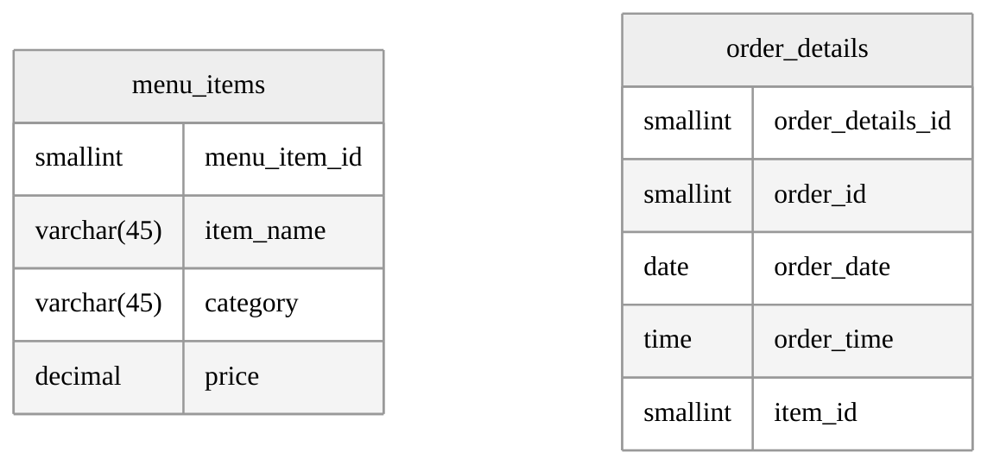

# 🛎️ Restaurant Order Analysis 🍽️
Analyze order data to identify the most and least popular menu items and types of cuisine.

## Tables

## Instructions 
import *create_restaurant_db.sql* into respective IDE and run it.

## Tools

    <a href="https://www.jetbrains.com/datagrip/">
         2025.3.1
    </a> 
    <a href="https://dev.mysql.com/downloads/installer/">
         8.0.42
    </a>

 
