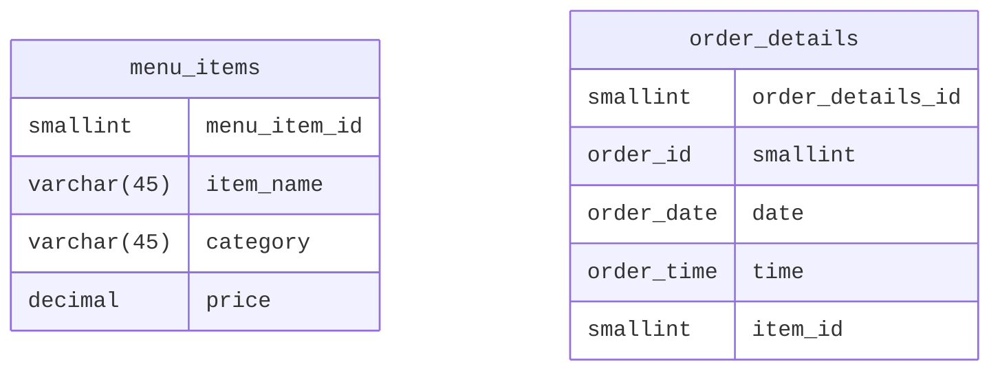

# Restaurant Order Analysis
Analyze order data to identify the most and least popular menu items and types of cuisine

## Tables

```mermaid
%%{
    init: {
        "fontFamily": "monospace"
    }
}%%
erDiagram
    menu_items {
        smallint menu_item_id
        varchar(45) item_name
        varchar(45) category
        decimal price
    }
    order_details {
        smallint order_details_id
        order_id smallint
        order_date date
        order_time time
        smallint item_id
    }
```     

## User Instructions

    
    

   

